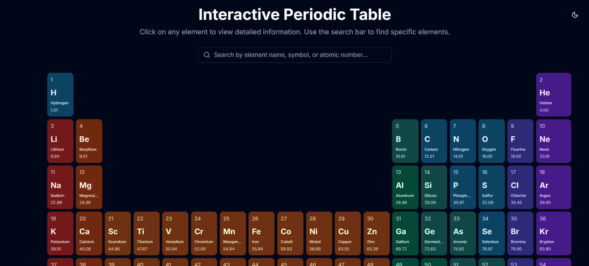

# Interactive Periodic Table

A modern, interactive periodic table built with Next.js and TypeScript. Experience chemistry in a whole new way with our feature-rich, responsive, and accessible web application.



## ✨ Features

### 🎯 Core Features
- **Interactive Element Cards**: Beautifully designed cards with essential element information
- **Smart Search**: Real-time element search by name, symbol, or atomic number
- **Dark Mode**: Eye-friendly dark theme as default with seamless theme switching
- **Hover Preview**: Hover over elements for 1-second to view detailed information
- **Responsive Design**: Seamless experience across all devices

### 🔍 Element Information
- Comprehensive element details including:
  - Atomic number and mass
  - Element category and block
  - Period and group
  - Electron configuration
  - Physical properties (melting/boiling points)
  - Historical discovery information

### 🎨 Visual Design
- **Category-Based Colors**: Distinct color schemes for different element categories
- **Smooth Transitions**: Polished animations and transitions
- **Accessibility**: High contrast ratios and screen reader support
- **Modern UI**: Clean, minimalist interface with shadcn/ui components

## 🛠️ Tech Stack

- **Framework**: Next.js 14 (App Router)
- **Language**: TypeScript
- **Styling**: Tailwind CSS
- **Components**: shadcn/ui
- **Theme**: next-themes
- **Icons**: Lucide Icons
- **Package Manager**: pnpm

## 🚀 Getting Started

1. **Clone the repository**
   ```bash
   git clone https://github.com/yourusername/periodic-table.git
   cd periodic-table
   ```

2. **Install dependencies**
   ```bash
   pnpm install
   ```

3. **Run the development server**
   ```bash
   pnpm dev
   ```

4. **Open the application**
   Navigate to [http://localhost:3000](http://localhost:3000)

## 📱 Usage

- **Search Elements**: Type in the search bar to filter elements
- **View Details**: Click on any element to see detailed information
- **Quick Preview**: Hover over elements for 1 second to see a preview
- **Theme Toggle**: Switch between light and dark modes using the theme toggle button
- **Responsive View**: Access on any device with a responsive layout

## 🎯 Future Enhancements

- Element comparison tool
- Interactive electron configuration builder
- 3D molecular structure viewer
- Advanced filtering by properties
- Quiz mode for educational purposes
- Temperature-based state of matter visualization
- Alternative periodic table layouts

## 🤝 Contributing

Contributions are welcome! Please feel free to submit a Pull Request.

## 📄 License

This project is licensed under the MIT License - see the [LICENSE](LICENSE) file for details.

## 🙏 Acknowledgments

- Data sourced from reliable chemistry databases
- Built with modern web technologies
- Inspired by the need for an accessible, modern periodic table

---

<div align="center">
Made with ❤️ using Next.js and TypeScript
</div>
